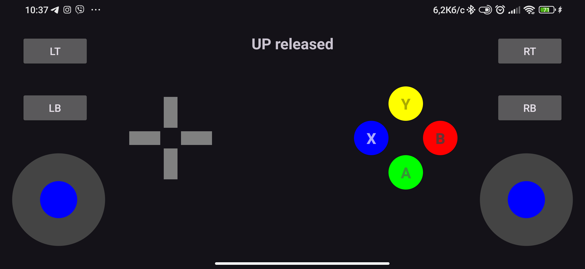

All configuration takes place in the main file

Websocket receives tokio::sync::broadcast::Sender, and the agent receives .. ::Receiver and sends messages to everyone who subscribes to it

The virtual gamepad connects to the ViGEm driver, and from there the OS sees the gamepad's movements

To connect to the server, I decided to make an Android application in Java in Android Studio. (Unfortunately, I connected Java to this project, but the Tauri tool is an incredible replacement in this regard. I didn't use it because I had no experience working with it).

The virtual joystick sends data from the gamepad to the server in JSON format whenever a button/trigger/stick is pressed.

Today`s last day when i can make modifications for this project, so waiting for mentors feedback

Java`s code at virtual_joystick_java/app/src ...