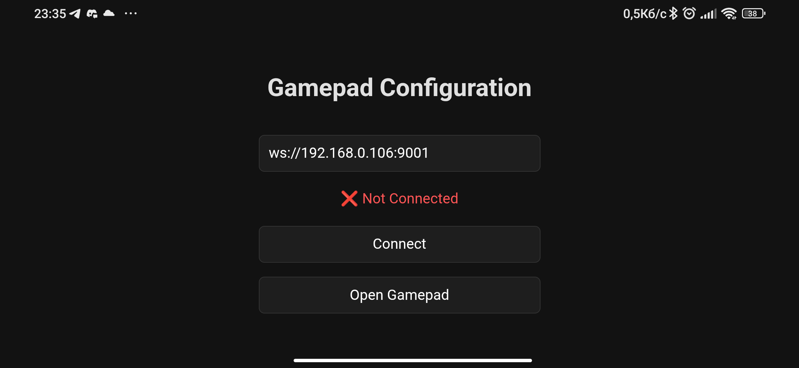
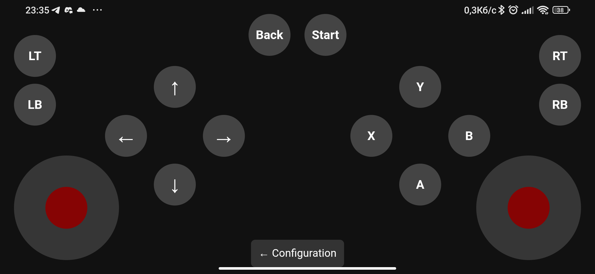

# Gamepad Controller  

A cross-platform virtual gamepad solution built with **Tauri** that streams real-time controller data via **WebSocket**.

## System Architecture  

| Component | Platform | Role |
|-----------|----------|------|
| **Tauri Gamepad App** | 📱 Android | Virtual controller interface |
| **WebSocket Server** | 🖥️ Windows PC | Data receiver & processor |

## 🚀 Quick Start  

### Server Side (Windows PC)

#### Prerequisites
**Install ViGEm Bus Driver**  
   Download and install from the official website:  
   https://vigembusdriver.com/

#### Launching the Server
Open terminal and run:

```bash
# Launch the WebSocket server
./this_project/virtual_gamepad.exe)
```
there this_project is the path where you clone git

If everything is OK you`ll hear the sound of connection device

### Client Side (Android Phone)  
1. **Download** and install the APK file on your Android device
2. **Configure Connection**:
   - Enter your PC's IP address
   - Set the server port (default: 9001)
3. **Connect & Play**:
   - Tap "Connect" to establish WebSocket connection
   - Switch to Gamepad interface to start controlling


*Configuration menu - enter server ip addr*

  
*Gamepad interface - virtual controls with dual joysticks and action buttons*

---

**Ready to transform your Android device into a powerful game controller!** 🎮